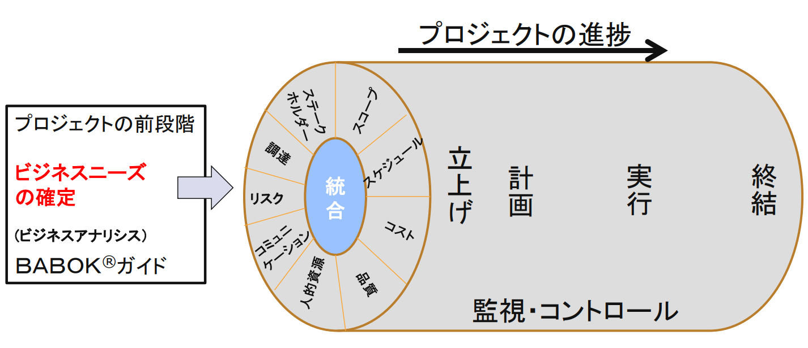
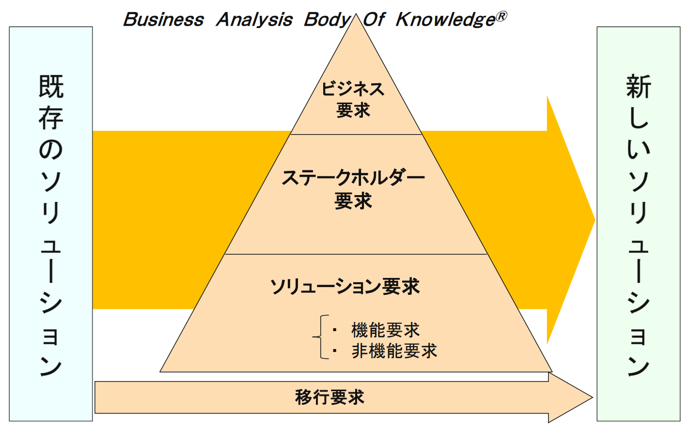
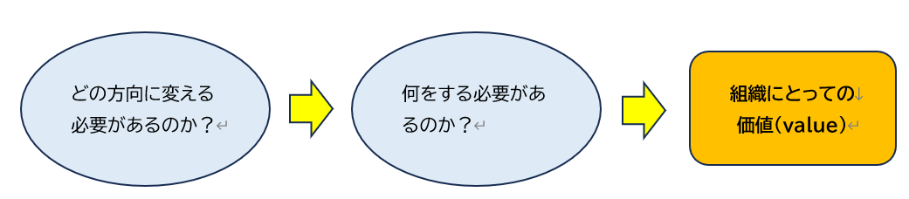

## 1.プロジェクトマネジメントの変遷

| プロジェクトマネジメント手法 | 開発手法 | ビジネス環境 | プロジェクトマネジメントの重点対象 | プロジェクト・チーム文化 |
| --- | --- | --- | --- | --- |
| Traditionalなプロジェクトマネジメント（1960頃～1995） | 予測型（ウォーターフォール型） | 顧客ニーズの変化が緩やか、納期が長い、均質な人材 | QCD（品質、コスト、納期） | 特になし（プロジェクト母体組織の文化に基づく） |
| モダン・プロジェクトマネジメント（1996頃～2000） ※1996年 PMBOK® 第1版発刊 | 予測型（ウォーターフォール型） | 顧客ニーズの変化が緩やか、大規模、多様な人材 | 統合、スコープ、タイム、コスト、リスク、人的資源、コミュニケーション、品質、調達 | 明確な責任分担に基づく指揮命令型の階層組織 |
| アジャイル・プロジェクトマネジメント（2000頃～） ※2001年 アジャイルマニフェスト ※2017年 PMBOK® 第7版発刊＋アジャイル実務ガイド | 適応駆動型（アジャイル型） | 顧客ニーズが目まぐるしく変わる、納期が非常に短い、多様な人材 | 個人と対話、動くソフトウェア、顧客との協働、変化への対応、ステークホルダーの満足度 | 顧客と開発者との協働作業を重視する自律型組織 |

### 1.1 プロジェクトマネジメント・スタンダードの変遷
　> **※ 別途図解予定（現在は文字で記載）**
PMBOK®ガイドを中心としたプロジェクトマネジメントのスタンダードは、時代とともに変化してきた。特に1996年の第1版発刊、2001年のアジャイルマニフェストは、新たな時代の到来を示している。

- 1996年: PMBOK®ガイド第1版
- 2000年: PMBOK®ガイド第2版
- 2001年: アジャイルマニフェスト
- 2004年: PMBOK®ガイド第3版
- 2008年: PMBOK®ガイド第4版
- 2013年: PMBOK®ガイド第5版
- 2017年: PMBOK®ガイド第6版 + アジャイル実務ガイド
- 2021年: PMBOK®ガイド第7版
- 2024年: PMI Infinity（プロジェクトマネジメントの新展開）
- 2025年: PMBOK®ガイド第8版（予想）

この流れは、QCDからPMBOKの知識エリアである統合、人的資源、リスク、ステークホルダー管理などへと重点が拡大し、さらにAI活用やビジネス価値創造が強調される方向へ進んでいる。

## 2. PMBOK®ガイドについて

- プロジェクト遂行における立上げ、計画、実行、監視・コントロール、終結の5つのプロセス群に含まれる合計49のプロセスを、統合、スコープ、タイム、コストなど10の知識エリアにまとめたもの。
- PMBOK®ガイドは、プロジェクトマネジメントの世界標準であり、1996年に初版が発行されて以来、何度か改訂されて現在は第7版となっているが、英語版の第8版が2025年11月にリリースされた。
- 原著の英語版をもとに欧米各国の言語はもとより、日本語、中国語、韓国語、ロシア語、アラビア語など10数ヶ国の言語に翻訳されている。
- 全世界で統一された言語と体系を用いることは、効率の良い実務が行えることにもつながる。近年、韓国や中国などアジアの新興国では、急速に世界標準に基づく教育を推し進めているのもそのためである。

## 3. プロジェクトとは

独自のプロダクト、サービス、所産を創造するために実施される有期性のある業務である。

- 独自性: 創出される成果物やサービス、所産は、基本的に唯一無二である。
- 有期性: 明確な開始時点と終結時点がある。
- 完了目標: 終了の判断ができる明確な目標がある。
           プロジェクト目標が達成されたとき、または途中で中止になったとき、プロジェクトは終了となる。

用語:
- プロダクトとは、生産され、定量化可能な、それ自身で最終生産物あるいはその構成要素の生産品となる人工物（成果物）。
- サービスとは、遂行される有用な作業で、実体のあるプロダクトまたは所産を生み出さないもの。生産や流通をサポートするビジネス機能の実施など。
- 所産とは、プロジェクトマネジメントのプロセスとアクティビティを実行して得られるアウトプット。

## 4. プロジェクトマネジメントとは

定められた期間と予算内で、求められる成果を達成する活動。

常に状況を先読みしながら、対立する要求事項間の最適バランスをとることにある。

- Pro: 前に、前方に。
- Ject: 投げる。
- Manage: 困難な状況で「なんとか対処する」。

> **※ 別途図解**

### プロジェクトマネジメントの例

- 成果: 友人3名とフリーマーケットに出典する
- 予算: 売上 5万円、経費 2万円
- 期間: 20XX年10月XX日 10時～14時

☆変更が発生
- 12時の時点で小雨のため、客足が鈍った⇒影響
- 売上⇒最適なバランスを図る
- 売上は落としたくない
- 終了時間を14時から16時まで延長する

## 5. PMBOK®ガイドの5つのプロセス群と10の知識エリア

- プロジェクトの進捗管理は、スケジュールだけで考えるのではなく、常に10の知識エリアの切り口で考える
    - 知識エリアには、それぞれ仕事の内容を表した「プロセス」がある
    - [プロセス]は、5つに分類される。

## 6. ビジネスニーズとプロジェクトをつなぐBABOK®の要求の体系

### 変革によって組織にとっての価値を生み出す

- ビジネスルールの整備
- ビジネスプロセスの整備
- ＩＴの仕組みの構築
- ビジネスニーズのソリューション
をプロジェクトで実現など

ビジネスアナリシスで答えを出すビジネス戦略をモデル化する一つの方法がビジネスモデルキャンパス

PMBOK®の”立ち上げ”でのプロジェクト憲章のビジネスケース（ビジネスニーズ） 
文書化された経済的な実現可能性調査。十分な定義がないまま選ばれた 
ソリューション・コンポーネントのベネフィット（価値）の妥当性を 
確立するために使用される。また、さらなるプロジェクトマネジメント活動 
を許可するための基礎として使用される 
（PMBOK®ガイド第6版）

